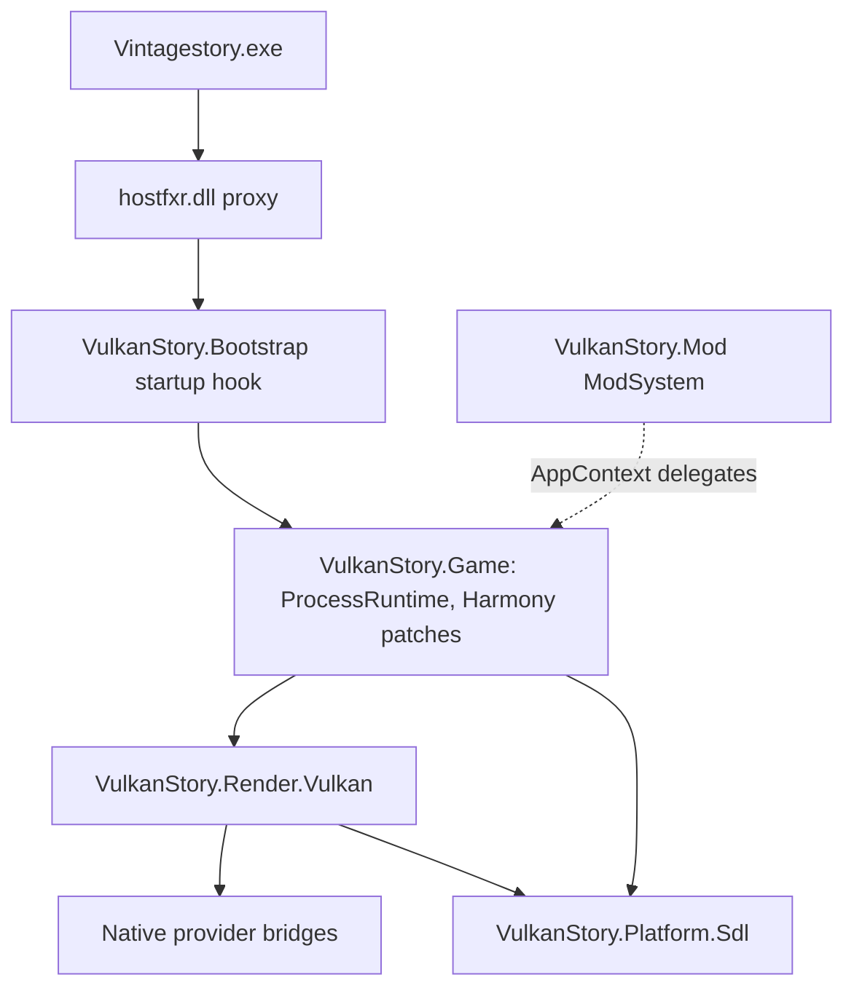

# VulkanStory architecture

VulkanStory replaces Vintage Story's OpenGL client renderer with Vulkan and its GLFW
window with SDL3. It runs inside the official game's own .NET 10 process, started
from the normal shortcut, against the unmodified official game assemblies (profile
`vs-1.22.7`). Feature status is tracked in the [roadmap](ROADMAP.md); activation and
packaging are described in [bootstrap and installation](bootstrap-and-installation.md).

Design rules:

- No launcher, copied game directory, modified or cached game assemblies, or
  injected members. Additional state lives in VulkanStory objects.
- Game assemblies are referenced at compile time with `Private=false` and are never
  shipped.
- Game internals and Harmony stay in `VulkanStory.Game`. Renderer, SDL and provider
  code is game-independent.
- No graphics initialization while the OS loader lock is held.
- Migrated files keep their provenance and license notices.

## Components

| Project | Responsibility | References |
| --- | --- | --- |
| `VulkanStory.Bootstrap` | Startup-hook entry: process/profile checks, dependency resolver, loads the game integration | Framework only |
| `VulkanStory.Contracts` | Game-independent renderer contracts: mesh/texture/shader definitions, temporal frame data, upscaler plans, latency selection | None |
| `VulkanStory.Platform.Sdl` | SDL3 window, Vulkan surface support, event pump, window coordinates | `ppy.SDL3-CS` |
| `VulkanStory.Render.Vulkan` | Vulkan device, resources, frame graph, pipelines and shader translation, upscalers, frame generation, presentation, latency | Contracts, Platform.Sdl, Silk.NET Vulkan/Shaderc |
| `VulkanStory.Game` | Process runtime, startup routing, Harmony patches, graphics/platform adapters, temporal state, controller input, mod pass API | All of the above, official game assemblies, game-shipped Harmony and Mono.Cecil |
| `VulkanStory.Mod` | Ordinary client `ModSystem`: settings dialog, `.vulkanstory` command, FPS HUD, world lifecycle callbacks | `VintagestoryAPI` only |
| `VulkanStory.Input` | Analog movement protocol shared by client and server | `VintagestoryAPI` |
| `VulkanStory.Input.Companion` | Optional server mod for negotiated analog movement | Input, `VintagestoryAPI`, Harmony |
| `src/Shared` | Settings choices and settings panel compiled into more than one project | — |

Other source trees:

| Path | Contents |
| --- | --- |
| `native/bootstrap` | Windows `hostfxr.dll` proxy (CMake) |
| `native/vma`, `sdk/vma` | Required allocation bridge and unmodified Vulkan Memory Allocator 3.4.0 submodule |
| `native/ngx`, `fsr3`, `fsr4`, `xess-fg`, `streamline` | C/C++ provider bridges loaded by the renderer |
| `shaders/native` | Maintained GLSL corpus for native (non-translated) pipelines |
| `tools/VulkanStory.Shaders.Compiler` | Compiles `shaders/native` to SPIR-V plus `shaders.manifest.json`, packed into `shaders-vk.pak` |
| `tools/VulkanStory.GameProfile` | Verifies an installation against the startup IL profile and writes an operand inventory |
| `tools/VulkanStory.Preflight` | Standalone Vulkan/SDL device, surface and swapchain preflights |
| `profiles/` | Supported game profiles: file hashes per platform and the startup IL profile |
| `sdk/` | Vendor SDKs as pinned git submodules |

## Runtime ownership

`VulkanStory.Game.RuntimeBootstrap` creates one `ProcessRuntime` per process. It owns
the `StartupRoutingTransaction`, the original `ClientPlatformWindows` reference and
the `GameRenderSession` (SDL window, Vulkan device, adapters). All runtime
transitions run on the game's entry thread.

The ordinary mod never loads the renderer itself. `VulkanStory.Mod` references only
`VintagestoryAPI` and reaches the runtime through framework-typed delegates that the
runtime publishes in `AppContext` under `VulkanStory.Runtime.*` (settings, status,
FPS, world ready/left, controller panel). If the early runtime is missing or
bypassed, the mod still loads and reports that state.

Lifetimes:

- **Process:** SDL window, Vulkan device, menu rendering, pipeline caches. They live
  from the first window request until application shutdown.
- **World:** temporal histories, motion histories, mod pass registrations and
  game-state references. `WorldReady`/`WorldLeft` are queued to the owner thread and
  attach/detach world state without recreating the device.
- **Shutdown:** stop frames, drain GPU work, release providers and resources,
  destroy device and surface, destroy the SDL window, remove patches, clear the
  `AppContext` delegates. Nothing runs from `DLL_PROCESS_DETACH`.

Settings that affect device or window creation, such as the renderer switch,
native shaders and Streamline, apply at the next launch. Other settings apply live
through the runtime's control queue.

## Startup routing

The startup hook runs before `Main`. `RuntimeBootstrap.Install` binds the 1.22.7
profile (`VersionProfile1227`), including the original `VSEssentials` and
`VSSurvivalMod` assemblies, and prepares a `StartupRoutingTransaction` with six
mandatory patch groups:

| Group | Purpose |
| --- | --- |
| `platform-construction` | Platform constructor side effects |
| `window-creation` | Replace GLFW window/context creation with the SDL session |
| `window-consumers` | Focus, size, cursor, clipboard, IME, fullscreen, close handling |
| `graphics-api` | Composite of the graphics subgroups: textures, shaders, shader sources, meshes, states, framebuffers, queries/capture, platform, temporal, motion uniforms, UI, menu settings, controller hints/analog, scene, post-processing, mod compatibility |
| `frame-loop` | Hand the game's frame delegate to the SDL loop |
| `shutdown` | Drain and tear down in order |

The transaction validates every target (exact signatures, IL anchors from the
embedded startup IL profile) before mutating anything, then installs all groups.
Patches stay dormant (`RoutingEnabled == false`) until commit. Any install failure
removes the attempted groups in reverse order.

At the game's first window request:

1. The runtime reads the game's data path, the mod manager's disabled list and
   `ModConfig/vulkanstory.json`. If VulkanStory is disabled, routing is removed
   and the original OpenGL startup continues.
2. Otherwise it creates the SDL window and Vulkan device, then sets routing active.
   A failure before commit releases the partial session, removes the patches and
   continues original startup. After commit, no OpenGL call is ever made against
   Vulkan resources.

The original `ClientPlatformWindows` instance stays intact. `GamePlatformAdapter`
associates it with the SDL host through a `ConditionalWeakTable`. An SDL window is
never cast into a `GameWindowNative` or GLFW pointer; platform window queries go
through the adapter.

Patches use the game's own `Lib/0Harmony.dll`
([patching guide](https://wiki.vintagestory.at/Modding:Monkey_patching)). They
target concrete methods or the call sites that touch native or GL state. Accessors
are bound once, so draw paths do no reflection or patch discovery.

## Rendering

`GameGraphicsAdapter` implements the game's graphics API surface (meshes, textures,
framebuffers, shaders, uniforms and UBOs, samplers, state, queries, readback) on top
of `VulkanDevice`. GL-shaped IDs used by game and mod code are owned by the adapter;
the same registry serves the game and third-party `RenderAPI` users, so an ID
created on one path resolves on another.

Shaders:

- Game GLSL is parsed, rewritten to Vulkan GLSL and compiled with shaderc at
  runtime. Results and the Vulkan pipeline cache live in
  `<game cache>/vulkanstory-vulkan`.
- Programs with a native replacement use precompiled SPIR-V (built from
  `shaders/native`), selected through `shaders.manifest.json`. The package ships
  both in one container, `VulkanStory/shaders-vk.pak` (`NativeShaderPack`: indexed
  entries with a SHA-256 each); a loose `shaders-vk/` directory is the development
  fallback when no pack is present. `VULKANSTORY_VK_SHADER_SOURCE` compiles a source
  tree at device start instead.
- `ShaderOverridePolicy` tracks shader assets changed by mods or resource packs and
  only uses a retained source where the original asset is unchanged.
- Staged sources use weak stage identities, so shader reloads release obsolete
  source text while live stages remain reusable across links.

`VulkanAllocator` delegates suballocation, memory blocks and mapping to VMA through
the private native bridge. Purpose/type pools retain the renderer's image, buffer,
staging and ReBAR policies; physical heap budget checks govern new memory blocks,
including provider headroom. Resource destruction still follows submitted GPU
timeline values. Framebuffer replacement releases the previous set and completes
its submitted retirements before allocating another set.

Frame data is passed explicitly rather than read from global settings:
`TemporalProviderFrame` carries jitter (render pixels), reset, frame time, camera
planes/FOV, position and the inverse view. Motion vectors are
`previousPixel - currentPixel` in render pixels from unjittered positions. World
and first-person hand views keep separate projection history.

Scene order: shadows and opaque world, transparency/OIT, AO (SSAO or GTAO),
temporal reconstruction (TAA or vendor SR), display-resolution post-processing,
HUD-free scene capture, separately composited UI, final composition, presentation
or frame generation. Screenshots read the completed composition.

## Providers

| Kind | Providers |
| --- | --- |
| Anti-aliasing / scaling | TAA, render scale, FSR 1 (EASU scaling, RCAS sharpening) |
| Ambient occlusion | Vanilla SSAO, GTAO |
| Upscaling | DLSS (NGX), FSR 3.1, FSR 4 (DX12 interop), XeSS |
| Frame generation | DLSS-G (Streamline), FSR 3 FG, XeSS-FG (DX12 interop) |
| Latency | Reflex / PC Latency (Streamline), AMD Anti-Lag, XeLL |

- Providers request instance/device extensions through
  `IDeviceRequirementContributor` before Vulkan creation. Unsupported extensions
  are refused and reported, never named in the create info.
- A missing optional runtime disables only that provider.
- Exactly one presentation owner and one frame-pacing authority are active at a time.
- FSR 4 and XeSS-FG run on DX12 and exchange images and fences with Vulkan through
  shared NT handles (`IDx12SharedRuntime`). That interop stays inside the renderer
  and the bridges.
- Native bridges and vendor runtimes load from `VulkanStory/native/<rid>`. A
  deployed payload never falls back to similarly named DLLs elsewhere.
- Quality modes and frame-generation multipliers come from SDK capability queries.

## SDL window and input

`SdlWindowHost` owns window creation, Vulkan surface requirements,
resize/minimize/fullscreen, cursor capture, clipboard, text input, and destruction.
`SdlEventPump` runs once per frame on the owner thread. `GameInputBridge` converts
SDL events into the game's normal input handlers, including DPI conversion, IME
composition, focus-loss resets and close cancellation.

Controller support (gamepad mapping, GUI cursor navigation, radial menu, on-screen
keyboard, PromptFont glyphs, touch-as-mouse) lives in `VulkanStory.Game/Input`, not
in the SDL library. Analog movement is negotiated with the server: the
`vulkanstoryinput` companion mod provides it in the integrated single-player server
and optionally on dedicated servers. Servers without it get digital movement.

## Compatibility with other mods

| Mod rendering path | Behavior |
| --- | --- |
| Game `RenderAPI` | Routed through the ordinary Vulkan adapter |
| VulkanStory pass API | `VulkanStory.Game.ModRendering`: declared passes at fixed stages, named attachments, motion writers, lifetime-bound registration |
| Direct OpenGL / OpenTK, native GL, GL proc-address loaders | Detected and refused |

The `graphics-mod-compatibility` group hooks the game's mod loader. While the Vulkan
renderer is active, before an enabled third-party client code mod is loaded or
compiled, `ModGlUsage` scans its
assembly metadata with Cecil for direct GL calls and native graphics imports,
without executing it. A mod with unsupported operations is refused through the
game's own mod-loading error path, so dependency handling and the mod manager behave
normally. `.vulkanstory status` lists the decisions. Arbitrary mods are not translated
from OpenGL to Vulkan automatically. A specific direct-GL mod needs its own adapter.

## Files and diagnostics

| Path | Contents |
| --- | --- |
| `<data>/ModConfig/vulkanstory.json` | Renderer settings |
| `<data>/ModConfig/vulkanstory-controllers.json` | Controller profiles |
| `<data>/ModConfig/gamecontrollerdb.txt` | Optional custom SDL controller mappings |
| `<data>/ModConfig/vulkanstory-ngx` | NGX data directory |
| `<game cache>/vulkanstory-vulkan` | Shader binaries and pipeline cache |
| `%LOCALAPPDATA%/VulkanStory/Logs/bootstrap-*.jsonl` | Native and managed bootstrap events |
| `<data>/Logs/client-main.log` | Runtime and provider messages |
