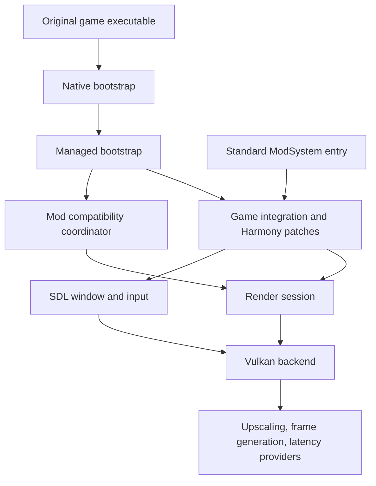

# VulkanStory architecture

Current work/status is tracked in [ROADMAP](ROADMAP.md), with recorded evidence in [current port status](current-port-status.md).
The dated design and milestone observations below are historical checkpoints;
they do not supersede that ledger's later implementation or recorded runs.

Design date: 2026-09-28. Updated 2026-09-29: B0 bootstrap, focused tests, and a normal-shortcut live run have been recorded. The early resolver source fix passed build and focused tests; a live Harmony observation with that revised payload remains open.

## Product contract

The user installs VulkanStory into an existing Vintage Story installation and continues using the normal shortcut. VulkanStory starts early enough to own the first graphics window, renders the menu and game with Vulkan, and supplies SDL windowing and input. It runs inside the game's existing .NET process. Its ordinary mod entry supplies settings and world-lifecycle integration once the standard mod loader runs.

The agreed Windows delivery direction is a native DLL proxy plus a contained VulkanStory payload. B0 uses an app-local `hostfxr.dll` proxy, preserving MFG Enabler's `version.dll` name. The live run proved pre-`Main` activation, but Harmony observation failed before patch installation. Runtime acceptance is still open. See [bootstrap and installation](bootstrap-and-installation.md) and the [B0 validation record](validation-b0-2026-09-29-03.md).

The project replaces Optimum completely. Reusable graphics algorithms and source files may be migrated with their provenance. Runtime ownership, project references, configuration, patch registration, and installation are new.

**Migration rule: preserve working code as directly as possible.** The renderer, SDL implementation, native provider bridges, shaders, resource layouts, and temporal mathematics are source-transplant candidates. Mechanical namespace/build changes and thin host/state interfaces are expected. The architecture boundaries below do not authorize rewriting those implementations. Refactors that are not needed to remove an Optimum or injected-game dependency wait until parity.

### Decisions and open questions

| Item | Decision or status |
| --- | --- |
| Normal game shortcut | Required; no custom launcher in the product flow. |
| Second game installation | Excluded; reuse the existing official installation. |
| Modified game assemblies or cached patched copies | Excluded from the architecture. |
| Early activation | Native bootstrap followed by managed Harmony initialization. Exact handoff awaits milestone B0. |
| Platform integration | Composition around the original game platform object; no subclass of the sealed platform. |
| SDL | Owns the visible window and input pump from graphics startup after early-loading acceptance. |
| Renderer core | Game-independent code and contracts. |
| Other mods using OpenGL | A planned compatibility module with bounded operation coverage and explicit per-mod adapters. |
| First reference game version | 1.22.7, subject to confirming exact official assembly/runtime identities. |
| Managed runtime | Match the official game's runtime; net10.0 is the current proposed target, consistent with the official mod template. |
| Platforms | Preserve Windows/Linux renderer support. Prove Windows activation first; Linux normal-shortcut activation remains a separate release gate. |
| macOS | Outside the current renderer's inherited support scope. |

The first two unknowns to resolve are reliable early activation and complete routing of the vanilla startup/window path. They determine whether the install promise can be delivered. Large-scale feature migration follows those proofs.

## Component boundaries



Arrows represent ownership or calls. Game types do not cross the integration boundary into the rendering and window packages. Provider code consumes renderer contracts and native handles with explicit lifetimes.

### Proposed source layout

```text
src/
  VulkanStory.Bootstrap/          # Small managed entry, dependency setup, activation policy
  VulkanStory.Contracts/          # Renderer/window/temporal/provider contracts; no game types
  VulkanStory.Render/             # Render session, scene pipeline, temporal processing, AO
  VulkanStory.Render.Vulkan/      # Device, resources, graph, transfers, shaders, presentation
  VulkanStory.Platform.Sdl/       # SDL window, events, IME, cursor, touch, gamepads
  VulkanStory.Game/               # Version adapter, Harmony patch groups, game resource bridge
  VulkanStory.Compatibility/      # Discovery, patch profiles, bounded OpenGL translation
  VulkanStory.Mod/                # Client ModSystem, UI, configuration, commands, mod API bridge
native/
  bootstrap/                     # Windows proxy and managed handoff only
  ngx/                           # Migrated and renamed NGX bridge
  streamline/                    # Migrated and renamed Streamline bridge
  xess-fg/                       # Vulkan/DX12 interoperability bridge
  fsr3/
  fsr4/
shaders/
  native/                        # Maintained GLSL source and includes
tools/
  ShaderCompiler/
  Package/
tests/
  Contracts/
  GameIntegration/
  Vulkan/
  Compatibility/
docs/
```

These are ownership boundaries, not a requirement to create every project immediately. Start with the bootstrap, contracts, game adapter, and mod entry. Keep the existing renderer and provider source organization together initially; a `RenderSession` can own it through a thin facade. Split renderer assemblies only when isolation or deployment requires it.

| Component | Owns | Dependency restriction |
| --- | --- | --- |
| Native bootstrap | Proxy exports, process selection, deterministic managed activation | No graphics initialization or managed execution from `DllMain`. |
| Managed bootstrap | Dependency resolution, version selection, patch transaction, startup diagnostics | Initial entry uses only framework dependencies; load game integration after resolution is configured. |
| Contracts | Typed handles, frame identity, image descriptions, temporal data, feature availability, window events | No Harmony, game assemblies, global configuration, or mutable game statics. |
| Render session | Scene stages, post-processing order, history, UI composition, settings application | Calls backend and host contracts. |
| Vulkan backend | Device/queues, resource state, submission, descriptor and pipeline caches, capture and presentation | No `ClientPlatformWindows`, `ClientSettings`, `ShaderProgramBase`, or game reflection. |
| SDL platform | Native window/surface information, logical/pixel sizes, input collection | No `ClientMain`, game GUI objects, or Harmony. |
| Game integration | Reads game state, binds typed accessors, patches existing methods/call sites | The only implementation that relies on private client/engine members. |
| Compatibility | Mod discovery, support plans, GL-shaped operation mapping, per-mod adapters | Reuses the same resource/state bridge as ordinary game rendering. |
| Standard mod entry | User settings, translations, lifecycle registration, extension API | Attaches to the already-running session; does not create a second device or patch owner. |

## Runtime ownership

One process-owned `VulkanStoryRuntime` owns a `PatchCoordinator`, `WindowHost`, `RenderSession`, `CompatibilityCoordinator`, `ResourceRegistry`, and diagnostics service. A world session is a child object with its own temporal history, registrations, and game-state references.

The standard mod entry looks up this existing runtime. Early and late assembly loads must resolve to the same managed assembly instances. Do not load a second copy of the game API or a second CLR. A custom load context is not the default design: game and third-party mod type identity must remain consistent.

World exit releases world resources, motion histories, and mod registrations. The device, SDL host, and menu rendering survive until application shutdown. `ModSystem.Dispose` detaches that world's hooks; it cannot unpatch process graphics while Vulkan-backed resources are still alive. Enabling/disabling the renderer and changes to bootstrap-critical options take effect after restart. The next launch honors the mod's disabled state.

At shutdown, stop new frames, stop provider presentation work, drain owned GPU work, release providers and frame resources, destroy the device/surface, destroy the SDL window, and detach remaining managed hooks. Native `DLL_PROCESS_DETACH` does not perform this work.

## Harmony and the game adapter

Keep the original `ClientPlatformWindows` instance and type intact. A VulkanStory-owned `GamePlatformAdapter` associates that object with rendering/window services and the additional state required by the mod. Use explicit owner dictionaries or `ConditionalWeakTable` for per-object state where appropriate; clear strong resource references on disposal. Do not reproduce injected fields inside the game's assembly.

Each patch belongs to a named group:

1. **Startup and window:** platform construction side effects, native window setup, event wiring, frame-loop entry, and shutdown.
2. **Graphics API:** meshes, textures, render targets, shader compilation/linking, uniforms, samplers, UBO/SSBO updates, state, queries, and readback.
3. **Scene producers:** terrain, entities and hands, sky, weather, particles, decals, shadows, liquids, OIT, and object rendering.
4. **Temporal and post-processing:** camera capture, jitter, motion producers, AO, reconstruction, bloom, final composition, and UI separation.
5. **Built-in mod adapters:** specific rendering methods in the official Essentials and Survival assemblies that bypass the ordinary graphics API.
6. **Window consumers:** focus, size, mouse position, clipboard, IME, fullscreen, screenshots, dialogs, close handling, and controller integration.

Patch existing concrete methods or the callers containing a native/field access. Do not try to patch an abstract method, turn a field into a property, or make a sealed type inheritable. Use prefixes for complete operations we own, postfixes for observation, transpilers for precise call-site substitutions, and finalizers for restoring state on exceptional paths. Use reverse patches only where their original-body behavior and other-mod interaction are explicitly required.

Every supported game profile records assembly identity, exact overload signatures, expected IL anchors and match counts, patch priority/order requirements, and a failure reason. Register all mandatory routing patches while routing remains disabled; enable the session only after the transaction succeeds. A partial installation must never send half a frame to Vulkan and half to OpenGL.

Cache field/method delegates during binding. Avoid reflection, patch discovery, shader parsing, and allocation in draw-call paths. There is no blanket per-frame scan of loaded assemblies.

### Startup orchestration

The early bootstrap must apply these patches before the relevant startup methods execute or become inlined into active callers. The startup adapter then:

- Preserves the game's normal argument handling, account/login flow, data paths, asset manager, audio, and single-player server lifecycle.
- Bypasses GLFW monitor/window/context work at the specific startup producers and provides SDL equivalents.
- Replaces the window setup, loop-entry, and matching cleanup operations through checked call-site substitutions in the game startup path.
- Routes all later platform window queries through the adapter. An SDL HWND or SDL window pointer is never cast into a `GameWindowNative` or GLFW pointer.
- Gives the SDL loop one callable game-frame delegate and one close-request delegate; the renderer never takes over simulation logic.

The existing `window` field cannot hold the new SDL host. The supported client profile must account for every mandatory game read of that field. Direct accesses in third-party mods require compatibility support. Hidden GLFW compatibility windows are not the selected product design; any need for one must be recorded as a changed requirement rather than silently introduced.

Prefer small, verified substitutions over copying the decompiled `ClientProgram.Start` body. If safe substitutions prove impractical, document the exact startup section that must be reimplemented and its maintenance cost before expanding it.

## Resource and draw contracts

The game bridge translates meshes, textures, framebuffer references, shader objects, and state into VulkanStory contracts. It owns any GL-shaped public IDs required by existing APIs. New exposed contracts use typed handles with resource kind and owner/lifetime information. Preserve existing internal resource IDs and layouts during migration; add the ownership/generation tracking needed at the new bridge without replacing the working allocator or resource managers.

The same registry serves normal game calls and compatible third-party rendering. A texture ID created through one route must resolve when another route binds or deletes it. Never interpret an arbitrary integer GL name as a Vulkan handle, and never let recycled IDs resolve to a destroyed resource. Preserve query results and object lifecycles as well as draw calls.

`StatedRenderState` can supply the initial compatibility state tracker, after removing game dependencies. Dedicated native terrain/entity/GUI paths remain available; both paths use the same resources, synchronization, and frame identity.

Retained draw data survives GPU completion. Descriptor replacement, image reuse, asynchronous upload, readback, shader reload, and provider switching follow the submission timeline. Swapchain retirement separately accounts for presentation completion.

### Frame data

The frame coordinator supplies explicit records rather than reading global game settings from the device:

- Monotonic rendered-frame ID, present identity, timing, and simulation/input boundaries.
- Render and display extents, viewport, active world/hand camera, current and previous matrices.
- Actual jitter in render pixels, temporal reset reason, motion validity, exposure, and available scene resources.
- Immutable settings snapshot for the frame and provider capability/availability reports.

Preserve the existing motion convention initially: previous unjittered pixel minus current unjittered pixel, with reactive coverage and the depth used by the writer. Keep world and hand camera histories separate. Do not change matrix conventions while migrating the integration.

The intended scene order remains shadow and world rendering, transparency/OIT, AO, temporal reconstruction or vendor SR, display-resolution post-processing and late scene overlays, HUD-free scene capture, separate premultiplied UI, final composition, and presentation/FG. Stage boundaries must match the actual producers and consumers; screenshots read completed composition.

Expose named scene/depth/motion/UI resources at the new contract boundary. Preserve the existing extended framebuffer slots internally during the port and keep slot translation inside the adapter. Replacing those slots throughout the working renderer is a later optional refactor.

### Providers

Retain the existing feature targets: TAA, GTAO and vanilla SSAO behavior, FSR 1 scaling/sharpening, DLSS SR, XeSS SR, FSR 3.1 SR, FSR 4 interop, DLSS-G, XeSS-FG, FSR 3 FG, Reflex/PCL, XeLL, and AMD Anti-Lag.

Providers contribute their requirements before Vulkan device creation. Missing optional runtimes disable only the relevant provider. Only one presentation owner and one active frame limiter/pacing authority operate at a time. FG receives matching frame IDs, motion, depth, HUD-free color, and UI with explicit lifetimes. Keep platform-specific DX12 interop inside the provider/backend layer.

Capability reporting determines available quality modes and FG multipliers. Retain the working baseline's validation records; new checks focus on the changed host, loader, frame, and presentation boundaries. External MFG Enabler behavior is recorded separately from the renderer's own supported provider capabilities.

## SDL window and input

The SDL host owns window creation, Vulkan surface requirements, resize/minimize/fullscreen state, cursor capture, clipboard, text composition, file drops, keyboard/mouse/touch/gamepad input, and eventual destruction. It emits neutral events. The game adapter converts them into the same game handlers and state transitions used by normal input.

The frame coordinator performs pacing/sleep, begins frame identity, collects input, marks simulation and render boundaries, invokes the game's frame delegate, submits, and presents. Keep provider-specific marker order from the existing contracts. All SDL event pumping happens once per frame on the appropriate thread; do not duplicate input through retained GLFW callbacks.

GUI-aware controller navigation, on-screen keyboard, and game-specific bindings belong in `VulkanStory.Game`/`VulkanStory.Mod`, not the SDL library. Preserve physical/controller arbitration, focus-loss resets, DPI conversion, IME composition, close cancellation, and gamepad hotplug behavior.

The existing negotiated analog movement path also has server-side hooks. Preserve these in a small optional ordinary input companion with no graphics dependency, including integrated single-player server support. Multiplayer servers without that companion retain the existing digital fallback. This supporting input feature is the limited exception to excluding unrelated server work.

## Compatibility with other OpenGL mods

Early loading is the foundation for this module: install discovery hooks before third-party mods are initialized, and redirect supported graphics operations before those mods allocate GL objects.

Use the game's mod loading boundary for discovery and identity. An assembly-load event is supplementary evidence, not a guarantee that no module initializer or static constructor has run. For an adapter requiring earlier interception, inspect the assembly file before its load and install shared API hooks ahead of it.

Compatibility has four levels:

| Level | Behavior |
| --- | --- |
| Game RenderAPI | Routed through the ordinary Vulkan adapter. |
| Known managed OpenTK operations | Targeted caller transpilers or verified wrapper patches route a bounded operation set into the shared resource/state bridge. |
| Named mod adapter | Versioned patches for custom shaders, render stages, unsupported calls, or unusual resource ownership. |
| Native OpenGL, custom proc-address loaders, opaque pointers, unsupported features | Report unsupported until an explicit bridge exists; discovery alone is insufficient. |

Do not ship a blanket hook of every OpenTK overload as the initial compatibility solution. Prefer caller-level redirection where OpenTK wrappers are generated, inlined, or native. Patch before mod rendering starts and verify exact overload coverage.

A support profile includes mod ID/version/assembly fingerprint, required entry points, shader features, resource ownership, patch ordering, and acceptance scenes. Static scans identify candidates and conflicts; they cannot prove a mod is compatible. Unknown or partially covered operations must not become silent no-ops.

The existing GLSL rewriter is reusable as a supported shader subset. Track custom blocks, samplers, shader includes/overrides, uniform relinking, and unsupported stages explicitly. Shader translation alone does not translate the surrounding GL state/resource API.

Do not advertise arbitrary automatic OpenGL-to-Vulkan conversion. A late diagnostic may identify a missing adapter, but switching the running renderer back to OpenGL requires a controlled restart. Planned future capture tooling should produce enough owner/call-site information to implement and validate an adapter without logging every draw in ordinary play.

Provide a small documented VulkanStory mod API for named render passes, declared resource access, motion writers, availability, and lifetime-bound handles. This lets cooperating mods avoid compatibility patches.

## Settings, failures, and observability

Use a new versioned configuration under the active game's `ModConfig/vulkanstory.json`, plus a minimal package-local loader enable/bypass configuration. Keep shader/pipeline caches under the game's cache directory. Do not consume `optimum.json` or `OPTIMUM_*` variables implicitly.

Early activation resolves the game's actual data path and respects disabled mods before taking ownership. The mod UI distinguishes restart-required renderer activation from supported live settings. Provider failure can select an available fallback; bootstrap or mandatory integration failure cannot leave partial graphics routing enabled.

Before Vulkan resources become visible to game objects, failure can roll back managed patch registration and continue the original startup if that path is still intact. After ownership commits, use controlled teardown/restart and a one-launch recovery marker. Never resume vanilla GL methods against Vulkan resource IDs.

Record selected game profile, bootstrap timing, patch transaction, GPU/driver, active window backend, provider availability, mod compatibility decisions, and shutdown status. Capture/performance instrumentation is opt-in. One concise status view should make renderer/provider failure reasons understandable to players.

## Source evidence and limits

- The existing subclass and injected-member checks are in `D:\Coding\VulkanStory\Optimum.Render.Vulkan\Platform\VulkanClientPlatform.cs`; they are migration inputs, not the new runtime interface.
- Existing startup changes are in `patches/VintagestoryLib/Vintagestory.Client/ClientProgram.cs.patch`; they identify work that must be expressed through the new game adapter.
- The local `ScreenManager`, `SystemModHandler`, and `ClientSystemStartup` sources show ordinary mod startup occurring after platform/window creation. The `build` tree is a patched development source tree, so new patch targets must be bound against clean official binaries.
- [Vintage Story Harmony guidance](https://wiki.vintagestory.at/Modding:Monkey_patching) describes ordinary mod patch registration and field limitations.
- [Harmony runtime patching limits](https://harmony.pardeike.net/v3/articles/intro.html) support method-body adaptation; they do not provide type-layout changes. Implementation must use the game's verified shipped Harmony version, not assume Harmony 3 APIs.
- [Official mod project template](https://github.com/anegostudios/vsmodtemplate/blob/master/ModTemplate/ModTemplate.csproj) currently targets net10.0 and references game assemblies without copying them.
