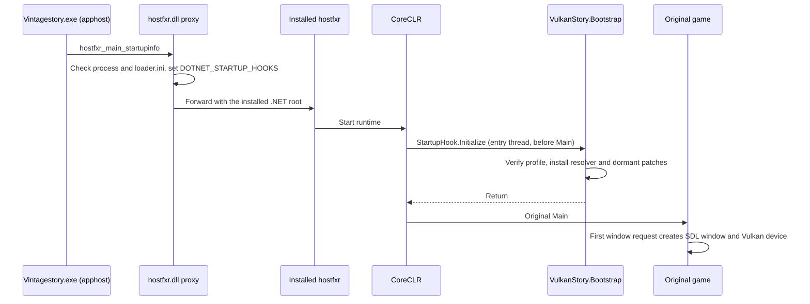

# Bootstrap and installation

VulkanStory is a drop-in for an existing official Vintage Story installation. It
has to own the first game window, so it activates before the game's `Main` runs.
A ZIP placed only in `Mods` cannot do that. Player-facing steps are in the packaged
[client README](../packaging/README-client.txt) and
[Linux README](../packaging/README-linux-client.txt).

## Windows activation

`Vintagestory.exe` is a framework-dependent .NET apphost. Before using the
installed .NET host, the apphost looks for an app-local `hostfxr.dll` in its own
directory. VulkanStory ships its proxy under that name (`native/bootstrap`). It
does not use `version.dll`, so it does not collide with proxies that do, such as an
MFG enabler.



### Native proxy

- `DllMain` only records the module handle and a timestamp. Host discovery, file
  checks, logging and environment changes happen in the forwarded export, outside
  the loader lock.
- Exports `hostfxr_main_startupinfo`, `hostfxr_main`,
  `hostfxr_main_bundle_startupinfo` and `hostfxr_set_error_writer`. Only
  `hostfxr_main_startupinfo` can arm the startup hook. The others forward unchanged.
- Finds the real host from `DotnetRoot` in `loader.ini`, then `DOTNET_ROOT_X64`,
  `DOTNET_ROOT`, the registered x64 install location, then `Program Files\dotnet`.
  It loads the newest `host/fxr/<version>/hostfxr.dll` and refuses to load itself
  recursively. The installed root is passed on as the .NET root, so frameworks are
  never resolved from the game directory.
- Arms the hook only when all of these hold: the host is `Vintagestory.exe`, the
  app is `Vintagestory.dll`, `[Bootstrap] Enabled` is not `0`, and
  `VulkanStory/managed/` contains `VulkanStory.Bootstrap.dll`,
  `VulkanStory.Game.dll` and `profiles/vs-1.22.7-win-x64.json`. The server, crash
  reporter and other tools only get forwarding.
- Prepends the hook path to any existing `DOTNET_STARTUP_HOOKS` and sets
  `VULKANSTORY_BOOTSTRAP_LOG`. Both are restored after the host call returns,
  unless something else has changed them in the meantime.
- If setting up the hook fails, only the hook is skipped and the game starts
  normally. If forwarding fails, the proxy returns a host error and tells the user
  to remove `hostfxr.dll`.
- Events are written to `%LOCALAPPDATA%\VulkanStory\Logs\bootstrap-<pid>-<qpc>.jsonl`.

### Managed bootstrap

`StartupHook.Initialize` runs once, on the entry thread, before `Main`:

1. Removes its own entry from `DOTNET_STARTUP_HOOKS`, so child processes do not
   inherit it.
2. Requires an x64 Windows or Linux process whose entry assembly is `Vintagestory`
   (or `dotnet` with `VULKANSTORY_HEADLESS=1` for the
   [headless harness](headless-harness.md)).
3. Reads `VulkanStory/loader.ini`. `Enabled=0` bypasses activation. A missing file
   means enabled on Windows and bypass on Linux.
4. Loads `managed/profiles/vs-1.22.7-<rid>.json`, requires .NET 10, and checks the
   SHA256 of the official game files listed there (executable, game assemblies,
   runtimeconfig/deps, `Lib/0Harmony.dll`, …).
5. Registers an `AssemblyLoadContext.Default.Resolving` handler. VulkanStory
   assemblies and their private dependencies (SDL3-CS, Silk.NET, DependencyModel)
   resolve from `VulkanStory/managed`. Game assemblies and Harmony resolve from the
   game directory and its `Lib` folder. Identities are checked; there is no
   mod-directory probing and no second load context.
6. Requires `VulkanStory.Game.dll` to have the same assembly version as the
   bootstrap, loads it into the default context and calls
   `RuntimeBootstrap.Install`. That prepares the dormant startup patch transaction
   described in [architecture](architecture.md#startup-routing).

Any failure unregisters the resolver, publishes `VulkanStory.Bootstrap.Status =
bypassed`, and lets the unmodified game start with OpenGL. A game update that
changes a profiled file therefore results in vanilla startup, not a partially
patched one. The ordinary mod reports the inactive state in the client log.

## Linux activation

Linux has no apphost proxy. `install-linux-runtime.sh` makes a one-time change to
the official `run.sh`, which the normal desktop entry launches. It inserts one
tagged block (`# BEGIN/END VULKANSTORY STARTUP HOOK v1`) before the unchanged
`./Vintagestory "$@"` line. The installer requires `run.sh` to match the profile
hash and to contain exactly one such invocation.

The block reads `[Bootstrap] Enabled` from `VulkanStory/loader.ini` (size-limited)
and, if enabled, appends `VulkanStory/managed/VulkanStory.Bootstrap.dll` to
`DOTNET_STARTUP_HOOKS`. Existing hooks are kept. From there the managed bootstrap
is the same as on Windows. Launch paths that start the `Vintagestory` binary
directly without `run.sh` are not activated.

The Linux native set is `libSDL3.so` and `libshaderc_shared.so`, plus an optional
`libVulkanStoryNgx.so` for DLSS (`packaging/native-linux-x64.json`). The
Streamline, FSR 4 and XeSS-FG bridges are Windows-only and are not included.

## `loader.ini`

```ini
[Bootstrap]
Enabled=1     ; 0 skips VulkanStory at the next launch
DotnetRoot=   ; Windows only: optional absolute .NET root for the proxy
```

## Package layout

Installed layout. On Windows the client archive is extracted directly into the game
directory; on Linux the installer copies it there:

```text
<game directory>/
  hostfxr.dll                      # Windows activation proxy
  VulkanStory/
    loader.ini
    README.txt
    package.json                   # Product identity and SHA256 inventory
    native-inventory.json
    install.json                   # Written by the installer: ownership receipt
    managed/
      VulkanStory.{Bootstrap,Contracts,Game,Input,Platform.Sdl,Render.Vulkan}.dll
      SDL3-CS.dll, Silk.NET.*.dll, Microsoft.*.dll
      profiles/vs-1.22.7-<rid>.json
    native/<rid>/                  # SDL3, shaderc, provider bridges, vendor runtimes
    shaders-vk/
      shaders.manifest.json
      <SPIR-V files>
    assets/gamecontrollerdb.txt
    tools/                         # deploy/remove (Windows) or install/remove (Linux)
    licenses/
  Mods/
    vulkanstory/                   # VulkanStory.Mod.dll, modinfo.json
    vulkanstoryinput/              # Input companion for the integrated server
```

`VulkanStory.Input.dll` exists in both `managed/` and `Mods/vulkanstoryinput/`.
Both copies come from the same build, so they have the same assembly identity.
Native and vendor DLLs are kept out of `Mods`, so the game's mod scanner never sees
them. A separate `VulkanStory-Input-Companion.zip` contains only
`vulkanstoryinput/`, for a dedicated server's `Mods` directory.

Windows `native/win-x64` (from `packaging/native-win-x64.json`):

| Component | Files |
| --- | --- |
| Core | `SDL3.dll`, `shaderc_shared.dll` |
| DLSS | `VulkanStoryNgx.dll`, `nvngx_dlss.dll` |
| FSR 3 | `VulkanStoryFsr3.dll`, `amd_fidelityfx_vk.dll` |
| FSR 4 | `VulkanStoryFsr4.dll`, `amd_fidelityfx_upscaler_dx12.dll` |
| XeSS | `libxess.dll` |
| XeSS-FG / XeLL | `VulkanStoryXessFg.dll`, `libxess_fg.dll`, `libxell.dll` |
| Streamline (DLSS-G, Reflex, PCL) | `VulkanStoryStreamline.dll`, `sl.interposer.dll`, `sl.common.dll`, `sl.reflex.dll`, `sl.pcl.dll`, `sl.dlss_g.dll`, `nvngx_dlssg.dll`, `NvLowLatencyVk.dll` |

## Building a package

Every script takes fresh output directories, documents its parameters
(`Get-Help scripts/<name>.ps1 -Full`) and never launches the game. Vendor SDKs are
pinned submodules under `sdk/` (`dlss`, `fidelityfx-vk`, `fidelityfx`, `xess`,
`streamline`) and are the scripts' default SDK roots.

| Step | Script | Result |
| --- | --- | --- |
| 1 | `fetch-streamline-release.ps1` | Hash-checked Streamline 2.14.1 release ZIP extracted to the git-ignored `sdk/streamline-release-2.14.1`. The production `bin/x64` runtimes come only from this ZIP |
| 2 | `build-runtime.ps1` | Managed projects, the Windows proxy (CMake) and the shader corpus in `artifacts/runtime-shaders/<Configuration>`. `-RuntimeIdentifier linux-x64` builds for Linux |
| 3 | `build-provider-bridges.ps1` | The five Windows bridges (needs `g++`/`gcc` and `VULKAN_SDK`) |
| 4 | `prepare-native-bundle.ps1` | Bridges, core binaries, vendor runtimes and notices from `native-win-x64.json`. Streamline runtimes must match the release hashes |
| 5 | `stage-runtime.ps1` | The layout above plus `optional-server/`. Checks shader manifest coverage and writes the SHA256 inventory `package.json` |
| 6 | `package-runtime.ps1` | Verifies the staged hashes and writes `VulkanStory-<rid>.zip`, `VulkanStory-Input-Companion.zip` and `archives.json` |

## Install, update, disable, remove

Close the game, server and crash reporter first.

| Operation | Windows | Linux |
| --- | --- | --- |
| Clean install | Extract the client ZIP into the game directory | Extract to a package directory, then `bash VulkanStory/tools/install-linux-runtime.sh <package> <game> <fresh-backup>` |
| Update | `VulkanStory/tools/deploy-runtime.ps1 -GameDirectory … -PackageDirectory … -BackupDirectory …` | Re-run the installer with the new package |
| Disable | Disable in the mod manager and restart, or set `Enabled=0` in `loader.ini` | Same |
| Remove | `VulkanStory/tools/remove-runtime.ps1 -GameDirectory … -BackupDirectory …` (supports `-WhatIf`) | `bash VulkanStory/tools/remove-linux-runtime.sh <game> <fresh-backup>` |

The installer/updater (`deploy-runtime.ps1`, `install-linux-runtime.sh`):

- checks the game against the package profile and the package against `package.json`
- refuses to overwrite files it does not own or that were modified, and does not
  follow symlinks or reparse points
- backs up overwritten files to a fresh directory outside the game and package
- writes dependencies first and the activation (`hostfxr.dll` or the `run.sh`
  block) last, and restores the previous state on failure
- keeps an existing `loader.ini` and deletes nothing. Files dropped from a newer
  package stay recorded as owned. Installed hashes go to `VulkanStory/install.json`
- on Windows, checks that an existing `version.dll` is unchanged

Removal removes the activation first. It then moves unchanged owned files to the
backup and leaves modified files, saves, settings, `version.dll` and empty
directories in place. On Linux it verifies the tagged block before restoring the
original `run.sh`.

Disabling in the mod manager takes effect at the next launch's first window
request: routing is removed and the game uses OpenGL. `Enabled=0` skips the
managed bootstrap entirely.

## References

- [.NET startup hooks](https://github.com/dotnet/runtime/blob/main/docs/design/features/host-startup-hook.md)
- [.NET host components](https://github.com/dotnet/runtime/blob/main/docs/design/features/host-components.md)
- [`DllMain` loader-lock rules](https://learn.microsoft.com/en-us/windows/win32/dlls/dllmain)
- [.NET default probing](https://learn.microsoft.com/en-us/dotnet/core/dependency-loading/default-probing)
