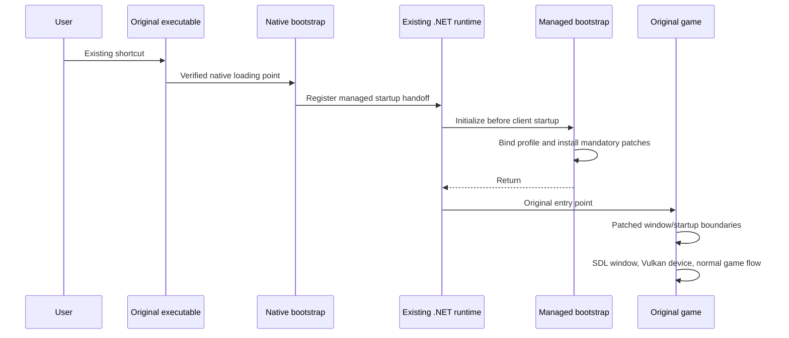

# Bootstrap and installation

Current work/status is tracked in [ROADMAP](ROADMAP.md), with recorded evidence in [development evidence](development-evidence.md).
Player instructions are in [the packaged client README](../packaging/README-client.txt).
The dated B0 observations below remain historical evidence for their own payloads.

Design date: 2026-09-28. Updated 2026-09-29: B0 implements an app-local `hostfxr.dll` proxy and managed startup hook. A normal-shortcut run proved pre-`Main` activation; the revised early resolver passed its build/test/stage batch but has not had a live Harmony check.

## Required user experience

On Windows, extract the VulkanStory package into the directory containing the original `Vintagestory.exe`, then use the existing shortcut. The renderer starts before the first game window. No alternate launcher, copied game directory, on-user-machine compilation, donor assembly, patched game DLL cache, or Optimum dependency is part of this design.

The package contains a small native activation DLL and the actual managed mod/renderer payload. The ordinary mod entry remains useful for settings, world events, and the mod manager; it is not responsible for first activation.

This delivery is a game-folder drop-in. It is not a ZIP that works solely by being placed in `Mods`.

## Why the shim must be proven first

The user already uses an MFG Enabler through a `version.dll` proxy. That establishes a useful installation model, but does not establish when that proxy loads relative to game graphics initialization.

Static PE inspection on 2026-09-28 of the local development copy at `D:\Coding\VulkanStory\.vanilla\win-x64\vintagestory\Vintagestory.exe` found ordinary imports of `SHELL32`, `ADVAPI32`, `KERNEL32`, `USER32`, and CRT API sets, with no `version.dll` import and no delay-import table. A dependency or later dynamic load may still load `version.dll`. The directory contains deployed Optimum artifacts, so this observation is not a certification of the official release binary.

The B0 prototype now selects `hostfxr.dll` using .NET apphost's explicit app-local host discovery. This avoids relying on a system DLL's incidental load time and does not occupy `version.dll`. The official client proved this early activation route in the third B0 batch; the remaining live gate is complete Harmony observation with the revised resolver. DLL search behavior, KnownDLLs/API sets, and absolute native loads mean an arbitrary renamed proxy is not an activation strategy.

## Activation sequence



The managed startup hook runs in the existing runtime and on the entry thread. It returns after preparation; it does not invoke the game's `Main` a second time. The real entry point then runs normally with the checked Harmony patches installed.

### Native bootstrap responsibilities

- Export the selected proxy's required ABI correctly, including names/ordinals where required.
- Forward normal calls to the actual system DLL or an explicitly supported downstream proxy.
- Limit activation to the client executable and supported architecture. Server, crash reporter, and tools retain normal forwarding.
- Establish one deterministic managed handoff before `ClientProgram.Start` executes. Repeated load/initialization attempts are idempotent.
- Locate payload paths relative to the module/game directory, independent of the working directory.
- Support a package-local bypass and bounded early diagnostic output.

Keep `DllMain` to minimal native bookkeeping. It must not execute managed code, initialize SDL/Vulkan/vendor libraries, wait for a worker, or perform a full dependency/configuration scan. The handoff must use a verified safe point outside the loader lock. Spawning a worker and hoping it beats game startup is explicitly excluded.

### Managed handoff candidates

The B0 handoff uses .NET's `StartupHook.Initialize()` facility. The app-local hostfxr proxy arms the process-local startup-hook environment in its startup-info export before forwarding to the installed real hostfxr. It therefore runs outside the loader lock and before hostpolicy consumes the hook configuration. The implementation does not use a native code detour or a background-thread race. This ordering is supported by the .NET 10 host source and awaits live game verification.

Merely setting `DOTNET_STARTUP_HOOKS` from a DLL loaded later is insufficient: the host may already have read it. Likewise, “the proxy loaded before a frame was drawn” is too late if the startup method we need to patch is already running.

If no suitable drop-in native loading point exists, stop B0 and report that delivery limitation. A one-time activation of a startup hook in the game's runtime configuration would preserve the normal shortcut, but changes the installation contract and requires a separate decision. Do not silently introduce a launcher, executable replacement, or late window takeover.

Do not treat UnityDoorstop as a ready-made solution for this game. Vintage Story uses ordinary CoreCLR hosting; a Unity-specific runtime entry is not its startup contract.

### Managed bootstrap responsibilities

1. Resolve the payload and confirm the package versions agree before loading renderer types.
2. Install narrowly scoped managed/native resolution for VulkanStory dependencies. Resolve the game's shipped Harmony and API identities once; do not ship a second game API or replace the game's OpenTK/runtime.
3. Select an explicit supported game integration profile against official assembly metadata. Avoid triggering graphics-sensitive game static constructors during discovery.
4. Resolve the active data path and renderer enable/disabled-mod policy at the correct point in original startup.
5. Bind and verify every mandatory patch target. Apply the patch transaction while graphics routing remains inactive.
6. Return to normal game startup, where the patched coordinator prepares SDL, Vulkan, and resources before committing graphics ownership.

The minimal startup-hook entry has no static dependency on game or vendor assemblies. Move dependency-heavy initialization into a separately loaded method after the resolver is installed. Any process-only startup-hook configuration owned by VulkanStory must not inadvertently activate the server, crash reporter, or child tools.

## Existing `version.dll` and MFG Enabler

Coexistence is a first-release requirement, because the user already has this setup. The installed RTXMFG proxy was located and fingerprinted at `C:\Users\N1GHT\Optimum\version.dll` on 2026-09-29. B0 selects `hostfxr.dll`, so it does not require renaming or chaining that proxy. Actual loader coexistence remains an acceptance case. The alternate strategies below apply only if later evidence forces a different activation route.

One file owns a proxy basename. Choose a supported route using evidence:

1. Use a different native proxy basename only if the clean game loads it early enough and its exports/search behavior have been verified.
2. If the existing proxy exposes a supported loading mechanism, let it activate the VulkanStory bootstrap and prove the timing.
3. If both proxies can safely chain, configure one explicit downstream path and verify forwarding plus both initializations with that exact combination.

Do not assume renaming either DLL preserves its behavior. Do not automatically replace an unknown proxy, recursively resolve the same basename, or load every DLL in a plugins directory. The real system-library path is explicit. A supported proxy chain must remain functional when VulkanStory itself is disabled.

A plain archive extractor cannot safely merge an existing conflicting `version.dll`. The clean-directory flow can be extract-and-run. The conflict flow needs either a verified nonconflicting package variant or a small optional installation helper that recognizes the supported pair and configures the chain. This helper performs installation only; it is never the normal game launcher.

MFG Enabler is an optional co-installed component, not a dependency. VulkanStory queries and reports the SDK/device capabilities it actually receives; the port does not assume particular unlocked multipliers.

## Runtime package layout (source implementation)

```text
<existing game directory>/
  Vintagestory.exe                      # Original
  Vintagestory.dll                      # Original
  VintagestoryLib.dll                   # Original
  VintagestoryAPI.dll                   # Original
  hostfxr.dll                          # B0 prototype; activation acceptance still pending
  VulkanStory/
    loader.ini                         # Minimal enabled/bypass and verified chain settings
    package.json                       # Product/bootstrap/shader schema and file inventory
    managed/
      VulkanStory.Bootstrap.dll
      VulkanStory.Contracts.dll
      VulkanStory.Game.dll
      VulkanStory.Render.Vulkan.dll
      VulkanStory.Platform.Sdl.dll
      VulkanStory.Input.dll
      <private managed dependencies>
    native/win-x64/
      SDL3.dll
      <shader compiler runtime>
      <VulkanStory provider bridges and redistributable runtimes>
    assets/
      gamecontrollerdb.txt
    shaders-vk/
      shaders.manifest.json
      <compiled SPIR-V variants>
    licenses/
  Mods/
    vulkanstory/
      modinfo.json
      VulkanStory.Mod.dll
<separate optional server artifact>/
  vulkanstoryinput/
    modinfo.json
    VulkanStory.Input.Companion.dll
    VulkanStory.Input.dll
```

The precise managed assembly split follows implementation needs; the identity and location of each assembly are unique. The early resolver and ordinary mod loader must converge on those same instances. Keep vendor/native DLLs outside the directory the game scans for managed code mods.

`scripts/build-runtime.ps1` builds production managed projects and the native
bootstrap without using a test project, and compiles the complete native shader
corpus unless `-SkipShaders` is selected. `scripts/build-provider-bridges.ps1`
builds the five Windows provider bridges from explicit SDK paths. Redistributable
SDK runtimes and notices remain separate inputs. `scripts/prepare-native-bundle.ps1`
selects them and the built bridges through `packaging/native-win-x64.json` into
a fresh native/licenses input bundle. All listed provider binaries are required
by runtime staging. Vendor SDKs are pinned git submodules under `sdk/` (`dlss`,
`fidelityfx-vk`, `fidelityfx`, `xess`, `streamline`) and are the scripts' default
SDK roots. The Streamline production runtimes ship only in the release ZIP:
`scripts/fetch-streamline-release.ps1` extracts it (hash-pinned) into the ignored
`sdk/streamline-release-2.14.1`, which preparation uses for `bin/x64` and requires
supplied plugin binaries to match.
`scripts/stage-runtime.ps1` assembles already
built outputs into a fresh directory, with explicit managed dependencies,
redistributable native and managed notices, controller mappings, the client mod
and SHA256 inventory. It checks shader manifest coverage against the native
program sources and hashes the referenced SPIR-V files. It does not establish
variant completeness or renderer/provider acceptance. The `optional-server`
subdirectory holds the separate server companion; only its `vulkanstoryinput`
directory is installed into a server's Mods directory when wanted.

`scripts/package-runtime.ps1` takes an existing staged payload and creates two
archives in a fresh output directory. `VulkanStory-win-x64.zip` extracts directly
into the existing game directory; `VulkanStory-Input-Companion.zip` extracts into
a server's Mods directory. Each archive receives its own file inventory, so the
client does not require optional server files. Source provenance notices accompany
both products. The archive script verifies staged file hashes and preserves the
recorded acceptance status; archive creation does not certify runtime behavior.

These scripts are unexecuted source as of 2026-10-01. The existing single-program
shader validation artifact cannot serve as the full runtime shader input.
Shaderc now selects `VulkanStory/native/<rid>` through an explicit Silk native
context. The renderer resolves XeLL there as well as NGX, and SDL/provider loads
on Windows search the selected DLL's directory for its sibling dependencies.
Native/provider binary completeness, private native loading, license bundle
completeness and normal-shortcut operation remain release gates. The old
observation-only B0 staging entry now refuses to assemble an incomplete current
runtime. No package has been generated or installed by this increment.

The late mod entry needs a small bootstrap-status path that can report a missing/disabled loader without first requiring unavailable renderer dependencies. Heavy runtime attachment occurs only after the early runtime is confirmed.

Resolve native libraries from VulkanStory's own RID directory through explicit paths/resolvers. Consolidate resolver ownership per managed assembly, including NGX, SDL, shaderc, and vendor bridges. Preserve each SDK's required co-location/search conventions. The device can run without an optional vendor runtime when that provider is not available.

Language/UI resources and native shader artifacts belong to this package. Vanilla assets come from the original game asset manager. Custom shader overrides are inspected at their normal load/reload boundaries; a custom include must invalidate the relevant native-shader eligibility.

## User flows

### Clean install

1. Close the game and extract the compatible package into its existing directory.
2. Start the normal shortcut. The menu reports VulkanStory's active backend and any unavailable optional features.
3. Configure graphics/controller options in the game.

No SDK, decompiler, shell script, or separate .NET runtime installation beyond the game's requirements should be needed. Release packages include their own required redistributable runtime dependencies.

### Update and game updates

Close the game before replacing the payload. A package inventory identifies VulkanStory-owned files so an updater can remove stale private dependencies without touching other mods. Mismatched bootstrap/payload versions bypass activation with a clear message.

`scripts/deploy-runtime.ps1` supports a fresh candidate install or an update from
a recorded B0/runtime installation. It checks official game and package hashes,
refuses unknown/modified executable payload collisions, requires closed game
processes, and backs up overwritten owned files outside the game directory.
Existing loader configuration is preserved. It writes only the client inventory,
records installed hashes, and verifies the co-installed version.dll is unchanged.
No deletion or stale-file cleanup is performed. A copy failure restores backed-up
files and retains newly added files for diagnosis. This deployment source has
not yet run; installation/startup acceptance remains open.

A game update requires a supported integration profile. The mod's minimum-version dependency declaration is not proof of patch compatibility with all newer builds. Unknown mandatory startup/graphics targets leave vanilla startup active where safe; never run a partially matched patch set.

### Disable, recovery, and removal

The mod manager marks renderer disablement as requiring restart; the next launch's early policy respects it. A package-local loader bypass is also available before managed initialization. Recoverable initialization failures before graphics commitment return to original startup. Failures after commitment require controlled termination/restart rather than GL calls against Vulkan handles.

Removing VulkanStory removes only its native activation component, owned payload, and mod entry. If a supported proxy chain was installed, restore its recorded chain configuration. Player saves remain in the normal data path. There are no official DLL backups to restore under this architecture.

## Linux

The renderer, SDL layer, and managed bootstrap remain portable. A Windows DLL proxy is not the Linux activation mechanism. `LD_PRELOAD` and startup hooks require the launch environment or entry script to activate them; dropping an arbitrary `.so` beside the executable does not do that automatically.

Gate B0-L must choose and prove a normal-shortcut activation route for supported Linux packaging: for example, an explicit one-time integration with the existing launch script/runtime configuration. The user-facing steps and update behavior must be specified before claiming Linux installation parity. Do not silently require a replacement game directory or label an unverified Windows/Wine setup as native Linux support.

## B0 acceptance evidence

One planned validation batch after the implementation must establish:

- Exact clean official game version, executable/assembly identities, runtime, OS, and selected proxy.
- Ordered markers proving native activation, managed bootstrap, patch completion, `ClientProgram.Start`, platform construction, and first window creation. No sleep-based race is acceptable.
- Normal-shortcut activation with a non-game working directory and paths containing spaces; correct data-path behavior.
- Bootstrap-disabled and unsupported-profile startup retaining correct native forwarding.
- No activation in dedicated server/crash reporter/tools.
- One shared managed runtime/assembly identity, no duplicate game entry execution.
- Supported existing-MFG-proxy coexistence, including VulkanStory disabled and both enabled.

B0 does not prove rendering correctness. It proves the installation and early ordering on which the rest of the architecture depends.

## Primary references

- [.NET startup-hook design](https://github.com/dotnet/runtime/blob/main/docs/design/features/host-startup-hook.md): managed initialization before entry, startup configuration timing, and dependency constraints.
- [.NET host components](https://github.com/dotnet/runtime/blob/main/docs/design/features/host-components.md): apphost, hostfxr, hostpolicy, and runtime responsibilities.
- [Windows `DllMain`](https://learn.microsoft.com/en-us/windows/win32/dlls/dllmain): loader-lock restrictions and separate initialization.
- [.NET default probing](https://learn.microsoft.com/en-us/dotnet/core/dependency-loading/default-probing): existing application probing takes precedence; a resolver is not an unrestricted assembly replacement mechanism.
- [UnityDoorstop](https://github.com/NeighTools/UnityDoorstop): its stated Unity runtime scope; reference material rather than an assumed compatible bootstrap.
